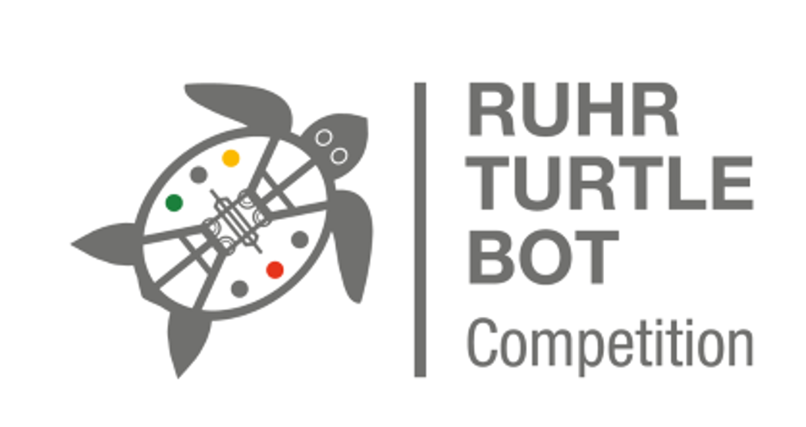

<div id="top"></div>

## About The Project
<div align="center">
  <a href="https://www.ruhrmasterschool.de/">
    
  </a>
</div>

<div align="center">
  <a href="https://www.ruhrmasterschool.de/">
    
  </a>
</div>

### Built With
* [ROS](http://wiki.ros.org/)
* [Turtlebot3 - Burger](https://emanual.robotis.com/docs/en/platform/turtlebot3/overview/)
* [DualShock 4 Wireless-Controller](https://www.playstation.com/de-de/accessories/dualshock-4-wireless-controller/)
<br />

## Run Code

### Karte aufnehmen (Steuerung mit DualShock 4 Wireless-Controller)
#### Simultaneous Localization and Mapping (SLAM)
   ```sh
   roslaunch rtc_project slam.launch gazebo:=false controller_layout:=2 map_file:=/home/lennart/catkin_ws/src/rtc_project/maps/Arena
   ```
* für das Arbeiten mit dem realen Turtlebot muss `gazebo:=false` sein.
* `controller_layout:=2` sorgt dafür, dass der Turtlebot mit den beiden Joysticks gesteuert wird.
* die SHARE - Taste führt den [`map_saver`](http://wiki.ros.org/map_server) aus, sodass die Karte unter `map_file` gespeichert wird.
<br />

### Navigationsziele setzen
   ```sh
   roslaunch rtc_project set_navigation_points.launch points_via_robot:=true gazebo:=false controller_layout:=2 map_file:=/home/lennart/catkin_ws/src/rtc_project/maps/Arena.yaml
   ```
   
   ```sh
   sudo ntpdate 192.168.1.111
   ```
   
#### RViz
* mit `points_via_robot:=false` werden die Ziele über den *2D Nav Goal* - Pfeil gesetzt.
* unter *Tool Properties* muss dafür das Topic **move_base_simple/set_goal** eingestell werden.
#### Turtlebot (DualShock 4 Wireless-Controller)
* mit `points_via_robot:=true` können die Navigationsziele mit dem Turtlebot *angefahren* werden.
* mit der SHARE - Taste wird die aktuelle Position und Orientierung des Turtlebots in eine **.txt** gespeichert ([publish_pose_2_file](https://github.com/ProfJust/rtc/blob/master/nodes/ue07_navigation_amcl/publish_pose_2_file.py)). 
<br />

### Navigation
#### Advanced Monte Carlo Localization (AMCL)
   ```sh
   roslaunch rtc_project navigation.launch gazebo:=false map_file:=/home/lennart/catkin_ws/src/rtc_project/maps/Arena.yaml
   ```
#### Ziele mit Action-Server anfahren 
   ```sh
   rosrun rtc_project turtlebot3_move_base_action_client.py /home/lennart/catkin_ws/src/rtc_project/maps/Arena_path.txt
   ```
* mit [turtlebot3_move_base_action_client](https://github.com/ProfJust/rtc/blob/master/nodes/ue07_navigation_amcl/turtlebot3_move_base_action_client.py) werden alle gesetzen Navigationsziele nacheinander angefahren.
<br />

<!---
## Sicherheitsfunktion, falls Marcel wieder nur am Rasen ist ;)
<div align="center">
  <a href="https://github.com/lennart2810/rtc_project/blob/master/scripts/ObjectWarnings.ipynb">
    
  </a>
</div>
-->

<br />


## Clone Repository
   ```sh
   git clone https://github.com/lennart2810/rtc_project.git
   ```

### Dependencies 
* [turtlebot3](https://github.com/ROBOTIS-GIT/turtlebot3)
* [ds4_driver](https://github.com/naoki-mizuno/ds4_driver)

## Credits
* [ProfJust](https://github.com/ProfJust/rtc)
* [ROBOTIS](https://github.com/ROBOTIS-GIT/turtlebot3)
* [Kaiyu Zheng](https://kaiyuzheng.me/documents/navguide.pdf)
* [naoki-mizuno](https://github.com/naoki-mizuno/ds4_driver)

<p align="right"><a href="#top">back to top</a></p>
