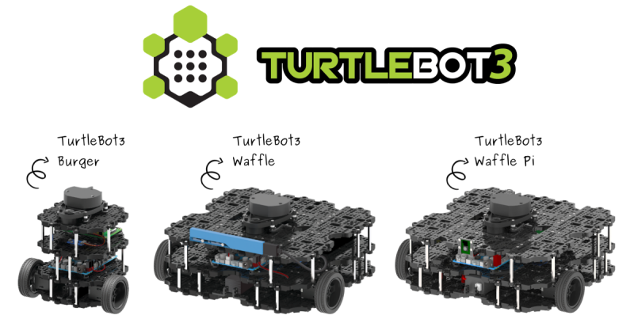
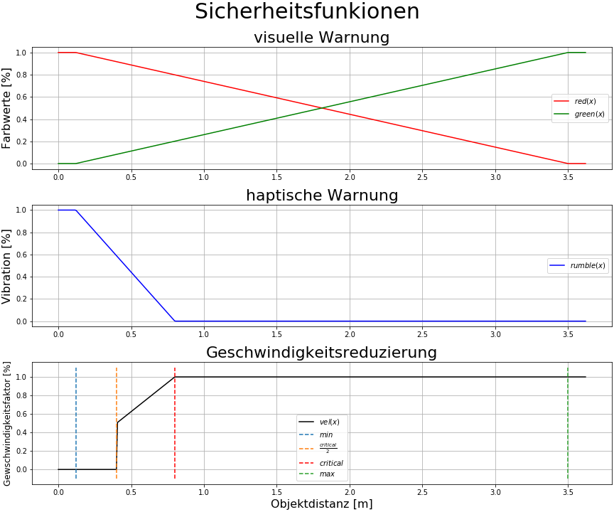

<div id="top"></div>

## About The Project
<div align="center">
  <a href="https://www.turtlebot.com/">
    
  </a>
</div>

### Built With
* [Turtlebot3 - Burger](https://emanual.robotis.com/docs/en/platform/turtlebot3/overview/)
* [ROS](http://wiki.ros.org/)
* [Python](https://www.python.org)
* [DualShock 4 Wireless-Controller](https://www.playstation.com/de-de/accessories/dualshock-4-wireless-controller/)
<br />

## Run Code (Gazebo)

### Karte aufnehmen (Steuerung mit DualShock 4 Wireless-Controller)
#### Simultaneous Localization and Mapping (SLAM)
   ```sh
   roslaunch rtc_project slam.launch gazebo:=false controller_layout:=2 map_file:=/home/lennart/catkin_ws/src/rtc_project/maps/default_map
   ```
* für das Arbeiten mit dem realen Turtlebot muss `gazebo:=false` sein.
* `controller_layout:=2` sorgt dafür, dass der Turtlebot mit den beiden Joysticks gesteuert wird.
* die SHARE - Taste führt den [`map_saver`](http://wiki.ros.org/map_server) aus, sodass die Karte unter `map_file` gespeichert wird.
<br />

### Navigationsziele setzen (Steuerung mit Controller)
   ```sh
   roslaunch rtc_project ps4_set_navigation_points.launch gazebo:=false controller_layout:=2 map_file:=/home/lennart/catkin_ws/src/rtc_project/maps/house_map.yaml
   ```
* mit derSHARE - Taste wird die aktuelle Position und Orientierung des Turtlebots in eine **.txt** gespeichert.  
   
wenn `gazebo:=true`:
   ```sh
   rosnode kill /robot_state_publisher
   ```
da `/tf` sonst von zu vielen nodes gepublished wird!

### Navigationsziele setzen (Punkte in RViz setzen)
...
<br />

### Navigation
#### Advanced Monte Carlo Localization (AMCL)
   ```sh
   roslaunch rtc_project navigation.launch gazebo:=false map_file:=/home/lennart/catkin_ws/src/rtc_project/maps/house_map.yaml
   ```
#### Sonar-Point-Cloud in Costmap eintragen
   ```sh
   rosrun rtc sonar_to_costmap.py
   ```
#### Ziele mit Action-Server anfahren 
   ```sh
   rosrun rtc_project turtlebot3_move_base_action_client.py /home/lennart/catkin_ws/src/rtc_project/maps/house_map_path.txt
   ```
<br />

## Sicherheitsfunktion, falls Marcel wieder nur am Rasen ist ;)
<div align="center">
  <a href="https://github.com/lennart2810/rtc_project/blob/master/scripts/ObjectWarnings.ipynb">
    
  </a>
</div>
<br />


## Clone Repository
   ```sh
   git clone https://github.com/lennart2810/rtc_project.git
   ```

### Dependencies 
* [turtlebot3](https://github.com/ROBOTIS-GIT/turtlebot3)
* [ds4_driver](https://github.com/naoki-mizuno/ds4_driver)

## Credits
* [ProfJust](https://github.com/ProfJust/rtc)
* [ROBOTIS](https://github.com/ROBOTIS-GIT/turtlebot3)
*  Navigation Tuning
* [naoki-mizuno](https://github.com/naoki-mizuno/ds4_driver)

## Contact
* _Lennart Fuhrig_ - [GitHub](https://github.com/lennart2810) 
* _Marcel Heinen_
* _Jonas Klinker_

<p align="right"><a href="#top">back to top</a></p>
